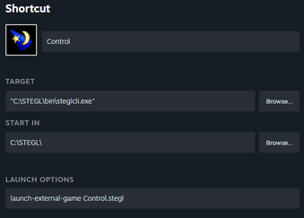
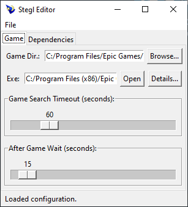
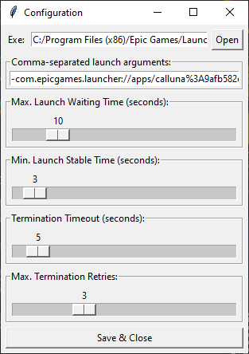

```
Launched using:

 ██████╗  ████████╗  ███████╗   ██████╗   ██╗
██╔════╝░░╚══██╔══╝░░██╔════╝░░██╔════╝░░░██║░░░
╚█████╗░░░░░░██║░░░░░█████╗░░░░██║░░██╗░░░██║░░░
 ╚═══██╗░░░░░██║░░░░░██╔══╝░░░░██║░░╚██╗░░██║░░░
██████╔╝░░░░░██║░░░░░███████╗░░╚██████╔╝░░███████╗
╚═════╝      ╚═╝     ╚══════╝   ╚═════╝   ╚══════╝
(Steam External Game Launcher)
```

# STEGL (**St**eam **E**xternal **G**ame **L**auchner)

Trying to get non-Steam games running posed a challenge when those games required an additional game launcher to run (e.g., Epic Games Launcher). The launchers would stay open and active even after the game was closed, making Steam think that the game was still running. This was especially problematic when streaming games using SteamLink.

For this reason, I developed *STEGL*, the *Steam External Game Launcher*. After configuration, *STEGL* ensures that all processes started with it will be properly terminated once the actual game is closed.

## Quickstart

Follow these steps to add a game to Steam using *STEGL*:

1. Create a .stegl configuration for your game/application using the [*STEGL* configurator UI](#the-stegl-configurator) and save it as `<GAMENAME>.stegl` (e.g. Control.stegl).
2. Create an empty file and name it `<GAMENAME>.exe` (e.g. Control.exe) and place it next to the .stegl configuration file you created previously. This file acts as a placeholder which you will configure to launch *STEGL* in the next steps.
3. [Add the created .exe to Steam as an external game](https://help.steampowered.com/en/faqs/view/4B8B-9697-2338-40EC).
4. Find the newly created entry in your Steam library and open "Properties..."
5. Point the `Target` path to the location of the `steglcli.exe`. Ensure that `Start In` is the parent-directory of your .stegl file. Set the `launch options` to `launch-external-game Control.stegl`.

Your configuration should now look similar to this (of course with your paths adjusted accordingly):



Now launch your game like usual through Steam :)

## How to use it

*STEGL* may be used directly [via python](#running-via-python) or by using the [pyinstaller executables](#running-via-pyinstaller-executables). Using the executables is recommended, but not strictly necessary. 

Note that *STEGL* was only tested on Windows host systems!

### Running via Python

Note that for running *STEGL* via Python, your environment must provide the packages included in the `requirements.txt`, with pyinstaller being optional if you don't plan to build the application.

*STEGL* offers a CLI, whose help-page can be launched using:
```
> python runstegl.py --help

Usage: runstegl.py [OPTIONS] COMMAND [ARGS]...

Options:
  --help  Show this message and exit.

Commands:
  launch-external-game  Invokes the external game with its dependencies...
  setup-game            (Default) Launches UI to create a configuration...
```

If run without the help-flag, the `setup-game` command will be executed, starting the [*STEGL* configurator](#the-stegl-configurator), a small GUI application for creating, editing and saving *STEGL* configuration files. You may have a look at `Control_Example.stegl`, an example *STEGL* configuration for the game Control, which I had to start throught the Epic Games Launcher. 

### Running via Pyinstaller Executables

The *STEGL* project is prepared to be built using pyinstaller (see [here](#building-stegl)). To accomodate both GUI and CLI usage on Windows, there are two executables: 

- `stegl.exe` launches the [*STEGL* configurator](#the-stegl-configurator)
- `steglcli.exe` is meant to be used via the command-line. The help-page described above can be launched using `steglcli.exe --help`.

## Configuration Options

All configuration options can be adjusted using the [*STEGL* configurator](#the-stegl-configurator).

The following provides a brief explanation of the possible configuration options that can be adjusted inside the configuration files. Take a look at the `Control_Example.stegl` example file to get a better idea of the structure of a configuration.

| General Options               | Default Value         | Description                                           |
|-------                        | -----------           | -------------                                         |
| `GAME.game_search_paths`      | -                     | *STEGL* identifies game processes by checking if the process's .exe filepath is child of one of the passed search paths. At least the installation directory of the game should be added. Note that inside the GUI application only a single search path can be specified.|
| `GAME.game_search_timeout`    | 60 sec                | How long after launching *STEGL* will search for a game-process before timing out. |
| `GAME.after_game_wait`        | 20 sec                | How long after closing the game *STEGL* will wait before stopping other processes (e.g. game launchers). This is mostly to ensure that a potentially ongoing cloud save is able to complete before the process is killed. |
| `GAME.launch_config`          | see Launch Options    | Options specifying how the game should be started (see below). |
| `DEPENDENCIES`                | see Launch Options    | Arbitrarily many dependencies may be specified using additional process launches. They share the same parameter set as `GAME.launch_config`. |

The following options define how the game process (and dependencies) should be launched:

| Launch Options               | Default Value         | Description                                           |
| -------                      | -----------           | -------------                                         |
| `exe_path`                   | -                     | Executable that should be launched. |
| `args`                       | -                     | List of arguments that should be passed to the executable during launch. |
| `max_launch_waiting`         | 10 sec                | An upper limit after which a process is considered as launched. The actual waiting time is most likely shorter because of the dynamic described in `min_launch_stable`. |
| `min_launch_stable`          | 3 sec                 | *STEGL* tries to determine when a process (and its child-processes) are finished launching by checking the set of running PIDs. `min_launch_stable` specifies the amount of seconds over which the PID set must be stable for the process to be considered as started. |
| `termination_timeout`        | 5 sec                 | How long a process may stay open after termination before it is considered a timeout. |
| `termination_retries`        | 3 times               | How often a termination is retried. A failed termination, for example, is caused by a timeout. |

## The STEGL Configurator

All configuration options mentioned above can be directly accessed / specified using the *STEGL* Configurator. All widgets offer a hover menu that directly show which value in the configuration file is edited by them.

 

## How does it work?

*STEGL* uses the fact, that child-processes inherit environment variables from their parent processes. After launching through the `steglcli.exe lauch-external-game` command, the script sets an according environment-variable, and from there on, it can filter the current process list by checking for its existence.

During game-launch, the list of found child processes is scanned for processes belonging to the game itself by checking if the process's .exe filepath is a child of one of the passed search paths in `GAME.game_search_paths`. Once such a process is found, the tool waits for its termination. After ensuring that there are no further game processes, the game is considered closed, and all remaining processes are also terminated.

If you are interested in the inner workings, checkout [`processlaunching.py`](./stegl/processlaunching.py).

Interfacing with the process information is done using the [psutil](https://pypi.org/project/psutil/) python library.

## 'Building' STEGL

The .exe files for *STEGL* can be built using [PyInstaller](https://pypi.org/project/pyinstaller/). For this, after having set up all python dependencies inside `requirements.txt`, run the `build.bat`. This will create the application in the directory `<project_dir>/dist/stegl`.

---
<br>
Enjoy, <br>
Maximilian Rüthlein